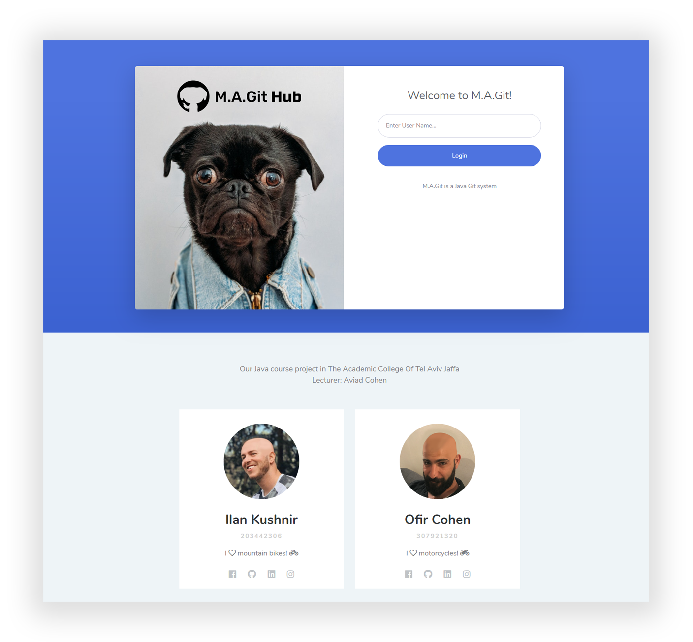

<div align="center">


</div>

# M.A.Git
> Our Java Git system, developed in the Academic College of Tel Aviv - Jaffa with the following technologies:


The project was developed during out summer semester under the guidance and characterization of Aviad Cohen.

<div align="center">




</div>

## Main Features

- [x] Commit
- [x] Merge
- [x] Collaboration: push / pull / fetch / fork & clone
- [x] Pull Request
- [x] Web working copy interface

## Compatibility

Our system is responsive & cross-platform:
- Web (tested on Chrome)
- Mobile Web
- Windows
- Mac OS
- Shell UI

### Installation

#### Tomcat
You can use [CocoaPods](http://tomcat.apache.org/) and add the `WEB_war.war` file:

1. Install Tomcat on your system.
2. Download the war file from the ```out/artifacts/``` folder.
3. Put the war file in ```/Tomcat/webapps/``` folder.
4. Navigate to `localhost:8080`.
5. Connect to Tomcat and run the War file.

## Key learnings

- Java
- JavaFX
- Java Script & JQuery
- HTML / CSS
- Tomcat Servlets
- Multithreading

## Team & Credits

- Authors: <a href="mailto:ilan.kushnir@gmail.com" target="_blank">Ilan Kushnir</a>, <a href="mailto:ofir5300@gmail.com" target="_blank">Ofir Cohen</a>
- Lecturer: Aviad Cohen
- <a href="https://www.mta.ac.il/" target="_blank">The Academic College of Tel Aviv - Yaffo</a>
